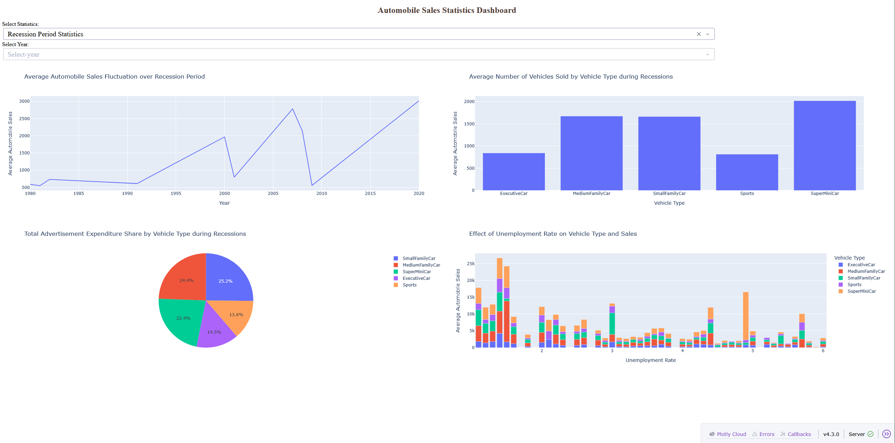
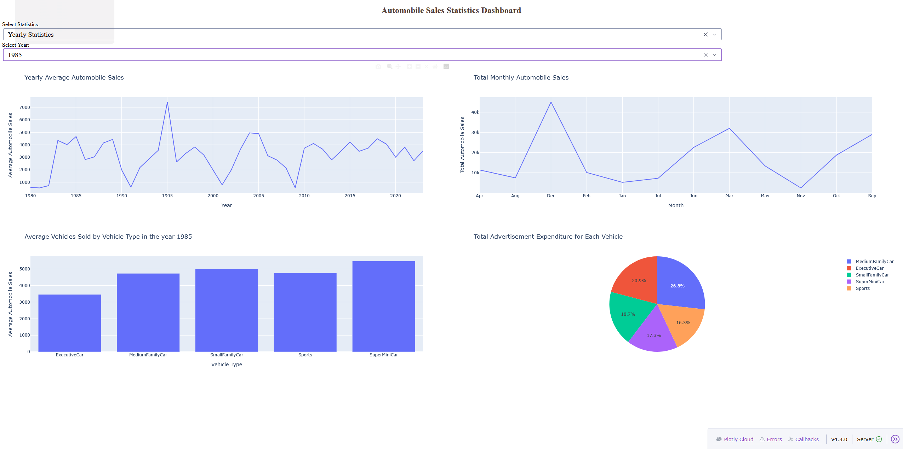

<h1 align="center">Part 2 Resolution Case Study</h1>  

<h1 align="center">Exercise 1: Understand the objective of the dashboard</h1>  

The purpose of this part of the final assignment is to build an interactive dashboard with `Plotly` and `Dash`. The dashboard analyses the historical trends of automobile sales and shows how the sales of XYZAutomotives were affected during recession periods.  

The dashboard must provide two main report types:  

| Report Type | Purpose |
| ----------- | ------- |
| `Yearly Statistics` | Shows automobile sales trends for a selected year, together with yearly and monthly sales analysis. |
| `Recession Period Statistics` | Shows automobile sales behaviour during recession periods only. |

The dashboard is built from the file named `DV0101EN-Final-Assign-Part-2-Questions.py`. In the original skeleton, several parts of the code are intentionally left incomplete with placeholders such as `...............`. Our goal is to replace those placeholders with correct Dash, pandas, and Plotly code.  

<h1 align="center">Exercise 2: Prepare the lab environment</h1>  

Start the Skills Network Cloud IDE / Theia environment as instructed in the course. Then open a new terminal by selecting `Terminal` on the menu bar and clicking `New Terminal`.  

If the skeleton file is not already available in your workspace, download it with the following command.  

```bash
wget https://cf-courses-data.s3.us.cloud-object-storage.appdomain.cloud/XJrh0TYekbbIbDPUGyaTZA/DV0101EN-Final-Assign-Part-2-Questions.py
```

Before running the Dash application, install the required Python packages. The course instructions suggest the following commands.  

```bash
pip3.8 install setuptools
python3.8 -m pip install packaging
python3.8 -m pip install pandas dash
pip install more-itertools
```

After this, open the file `DV0101EN-Final-Assign-Part-2-Questions.py` from the Explorer panel in Theia.  

<h1 align="center">Exercise 3: Import the required libraries and load the data</h1>  

At the beginning of the script, we need to import the libraries required to build the dashboard.  

The important packages are:  

| Package | Use |
| ------- | --- |
| `dash` | Creates the web application. |
| `dcc` | Provides Dash core components, such as dropdowns and graphs. |
| `html` | Provides HTML components, such as `Div`, `H1`, and `Label`. |
| `Input`, `Output` | Used to create interactive callbacks. |
| `pandas` | Loads and prepares the data. |
| `plotly.express` | Creates line charts, bar charts, and pie charts. |

The file starts by loading the automobile sales dataset from the provided IBM Cloud Object Storage URL.  

```python
import dash
from dash import dcc
from dash import html
from dash.dependencies import Input, Output
import pandas as pd
import plotly.express as px

# Load the data using pandas
data = pd.read_csv(
    'https://cf-courses-data.s3.us.cloud-object-storage.appdomain.cloud/d51iMGfp_t0QpO30Lym-dw/automobile-sales.csv'
)

# Initialize the Dash app
app = dash.Dash(__name__)

# Set the browser-tab title of the dashboard
app.title = "Automobile Sales Statistics Dashboard"
```

The line `app = dash.Dash(__name__)` creates the Dash application. The line `app.title = "Automobile Sales Statistics Dashboard"` sets the title that appears on the browser tab.  

<h1 align="center">Exercise 4: Complete Task 2.1 - Add the dashboard title</h1>  

Task 2.1 requires us to create a meaningful title for the dashboard. The title must be:  

```text
Automobile Sales Statistics Dashboard
```

The instructions also require the title to be centre aligned, coloured `#503D36`, and set to a font size of `24`.  

Inside `app.layout`, replace the incomplete `html.H1("...............")` section with the following code.  

```python
html.H1(
    "Automobile Sales Statistics Dashboard",
    style={
        'textAlign': 'center',
        'color': '#503D36',
        'fontSize': 24
    }
),
```

This creates the main heading of the dashboard. The dictionary passed to `style` controls the visual appearance of the title.  

Once this part is visible in the app, you can take a screenshot of the dashboard title if your submission requires evidence for Task 2.1.  

<h1 align="center">Exercise 5: Complete Task 2.2 - Add the dropdown menus</h1>  

Task 2.2 requires us to add two dropdown menus.  

The first dropdown allows the user to choose the type of report. It must contain two options:  

| Label | Value |
| ----- | ----- |
| `Yearly Statistics` | `Yearly Statistics` |
| `Recession Period Statistics` | `Recession Period Statistics` |

The second dropdown allows the user to choose the year. This dropdown will be enabled only when the user selects `Yearly Statistics`.  

First, create the dropdown options and year list before the layout section.  

```python
# Create the dropdown menu options
dropdown_options = [
    {'label': 'Yearly Statistics', 'value': 'Yearly Statistics'},
    {'label': 'Recession Period Statistics', 'value': 'Recession Period Statistics'}
]

# List of years
year_list = [i for i in range(1980, 2024, 1)]
```

Then, inside `app.layout`, create the first dropdown.  

```python
html.Div([
    html.Label("Select Statistics:"),
    dcc.Dropdown(
        id='dropdown-statistics',
        options=dropdown_options,
        value='Select Statistics',
        placeholder='Select a report type',
        style={
            'width': '80%',
            'padding': '3px',
            'font-size': '20px',
            'textAlignLast': 'center'
        }
    )
]),
```

The most important part of this component is the `id='dropdown-statistics'`, because the callback function will later use this ID to understand which report type has been selected.  

Now create the second dropdown for the year.  

```python
html.Div([
    html.Label("Select Year:"),
    dcc.Dropdown(
        id='select-year',
        options=[{'label': i, 'value': i} for i in year_list],
        value='Select-year',
        placeholder='Select-year',
        style={
            'width': '80%',
            'padding': '3px',
            'font-size': '20px',
            'textAlignLast': 'center'
        }
    )
]),
```

Here, `options=[{'label': i, 'value': i} for i in year_list]` automatically creates one dropdown option for each year in `year_list`.  

At this point, the dashboard has its title, its report-type dropdown, and its year-selection dropdown.  

<h1 align="center">Exercise 6: Complete Task 2.3 - Add the output container</h1>  

Task 2.3 requires us to add a division where the dashboard graphs will be displayed.  

The required values are:  

| Property | Value |
| -------- | ----- |
| `id` | `output-container` |
| `className` | `chart-grid` |
| `style` | `{'display': 'flex'}` |

In the final code, I also use `flexDirection: 'column'` so that the two graph rows appear one below the other.  

Add this section at the end of `app.layout`.  

```python
html.Div([
    html.Div(
        id='output-container',
        className='chart-grid',
        style={
            'display': 'flex',
            'flexDirection': 'column'
        }
    )
])
```

This empty `Div` is very important because the callback will later return the charts into it. In Dash, when we return objects into the `children` property of a component, those objects appear inside that component on the page.  

<h1 align="center">Exercise 7: Complete Task 2.4 - Create the callbacks</h1>  

Task 2.4 asks us to create two callback sections.  

The first callback enables or disables the year dropdown depending on the selected report type. The second callback creates and displays the graphs.  

<h2>Callback 1: Enable or disable the year dropdown</h2>  

The year dropdown is relevant only when the user selects `Yearly Statistics`. It should be disabled when the user selects `Recession Period Statistics`.  

A very important detail is that this callback controls the `disabled` property of the year dropdown. Therefore:  

| Returned value | Meaning |
| -------------- | ------- |
| `False` | The dropdown is enabled. |
| `True` | The dropdown is disabled. |

Write the callback as follows.  

```python
@app.callback(
    Output(component_id='select-year', component_property='disabled'),
    Input(component_id='dropdown-statistics', component_property='value')
)
def update_input_container(selected_statistics):
    if selected_statistics == 'Yearly Statistics':
        return False
    else:
        return True
```

This means:  

* if the user chooses `Yearly Statistics`, the year dropdown is enabled;  
* otherwise, the year dropdown is disabled.  

<h2>Callback 2: Update the output container with graphs</h2>  

The second callback updates the `children` property of the `output-container`. It uses two inputs:  

| Input component | Input property | Purpose |
| --------------- | -------------- | ------- |
| `dropdown-statistics` | `value` | Determines the selected report type. |
| `select-year` | `value` | Determines the selected year. |

The callback structure is as follows.  

```python
@app.callback(
    Output(component_id='output-container', component_property='children'),
    [
        Input(component_id='dropdown-statistics', component_property='value'),
        Input(component_id='select-year', component_property='value')
    ]
)
def update_output_container(selected_statistics, input_year):
    # The graph-building code will go here.
```

Inside this function, we use an `if` statement for `Recession Period Statistics` and an `elif` statement for `Yearly Statistics`.  

<h1 align="center">Exercise 8: Complete Task 2.5 - Create the Recession Period Statistics graphs</h1>  

Task 2.5 requires four graphs for the `Recession Period Statistics` report.  

First, we filter the data so that only recession periods are included. In the dataset, the column `Recession` uses `1` for recession periods and `0` for normal periods.  

```python
if selected_statistics == 'Recession Period Statistics':

    # Filter the data for recession periods
    recession_data = data[data['Recession'] == 1]
```

<h2>Recession Plot 1: Average automobile sales fluctuation over recession periods</h2>  

The first recession chart must show the average automobile sales by year during recession periods.  

To prepare the data, group by `Year` and calculate the mean of `Automobile_Sales`.  

```python
yearly_rec = recession_data.groupby('Year')['Automobile_Sales'].mean().reset_index()

R_chart1 = dcc.Graph(
    figure=px.line(
        yearly_rec,
        x='Year',
        y='Automobile_Sales',
        title='Average Automobile Sales Fluctuation over Recession Period',
        labels={
            'Year': 'Year',
            'Automobile_Sales': 'Average Automobile Sales'
        }
    )
)
```

Here, we use `px.line()` because the task asks for a line chart.  

<h2>Recession Plot 2: Average vehicles sold by vehicle type</h2>  

The second recession chart must show the average number of vehicles sold by vehicle type during recessions.  

To prepare the data, group by `Vehicle_Type` and calculate the mean of `Automobile_Sales`.  

```python
average_sales = recession_data.groupby('Vehicle_Type')['Automobile_Sales'].mean().reset_index()

R_chart2 = dcc.Graph(
    figure=px.bar(
        average_sales,
        x='Vehicle_Type',
        y='Automobile_Sales',
        title='Average Number of Vehicles Sold by Vehicle Type during Recessions',
        labels={
            'Vehicle_Type': 'Vehicle Type',
            'Automobile_Sales': 'Average Automobile Sales'
        }
    )
)
```

Here, we use `px.bar()` because the task asks for a bar chart.  

<h2>Recession Plot 3: Advertisement expenditure share by vehicle type</h2>  

The third recession chart must show the total advertising expenditure share by vehicle type during recessions.  

To prepare the data, group by `Vehicle_Type` and calculate the sum of `Advertising_Expenditure`.  

```python
exp_rec = recession_data.groupby('Vehicle_Type')['Advertising_Expenditure'].sum().reset_index()

R_chart3 = dcc.Graph(
    figure=px.pie(
        exp_rec,
        values='Advertising_Expenditure',
        names='Vehicle_Type',
        title='Total Advertisement Expenditure Share by Vehicle Type during Recessions'
    )
)
```

Here, we use `sum()` instead of `mean()` because a pie chart showing expenditure share should be based on the total expenditure.  

<h2>Recession Plot 4: Effect of unemployment rate on vehicle type and sales</h2>  

The fourth recession chart must show the effect of unemployment rate on automobile sales by vehicle type.  

To prepare the data, group by both `unemployment_rate` and `Vehicle_Type`, then calculate the average of `Automobile_Sales`.  

```python
unemp_data = recession_data.groupby(
    ['unemployment_rate', 'Vehicle_Type']
)['Automobile_Sales'].mean().reset_index()

R_chart4 = dcc.Graph(
    figure=px.bar(
        unemp_data,
        x='unemployment_rate',
        y='Automobile_Sales',
        color='Vehicle_Type',
        labels={
            'unemployment_rate': 'Unemployment Rate',
            'Automobile_Sales': 'Average Automobile Sales',
            'Vehicle_Type': 'Vehicle Type'
        },
        title='Effect of Unemployment Rate on Vehicle Type and Sales'
    )
)
```

The argument `color='Vehicle_Type'` separates the bars according to vehicle type, which makes the comparison easier to interpret.  

<h2>Return the recession charts</h2>  

Finally, return the four charts in two rows and two columns.  

```python
return [
    html.Div(
        className='chart-item',
        children=[
            html.Div(children=R_chart1, style={'width': '50%'}),
            html.Div(children=R_chart2, style={'width': '50%'})
        ],
        style={'display': 'flex'}
    ),
    html.Div(
        className='chart-item',
        children=[
            html.Div(children=R_chart3, style={'width': '50%'}),
            html.Div(children=R_chart4, style={'width': '50%'})
        ],
        style={'display': 'flex'}
    )
]
```

Once the application is running, select `Recession Period Statistics` from the first dropdown. The year dropdown should become disabled, and four recession graphs should appear. Save the screenshot as:  

```text
RecessionReportgraphs.png
```

<h1 align="center">Exercise 9: Complete Task 2.6 - Create the Yearly Statistics graphs</h1>  

Task 2.6 requires four graphs for the `Yearly Statistics` report.  

This report depends on the year selected by the user. Therefore, we first filter the dataset to keep only rows from the selected year.  

```python
elif selected_statistics == 'Yearly Statistics' and input_year != 'Select-year':

    # Filter the data for the selected year
    yearly_data = data[data['Year'] == input_year]
```

<h2>Yearly Plot 1: Yearly automobile sales for the whole period</h2>  

The first yearly chart must show average automobile sales for each year across the whole period.  

To prepare the data, group the full dataset by `Year` and calculate the mean of `Automobile_Sales`.  

```python
yas = data.groupby('Year')['Automobile_Sales'].mean().reset_index()

Y_chart1 = dcc.Graph(
    figure=px.line(
        yas,
        x='Year',
        y='Automobile_Sales',
        title='Yearly Average Automobile Sales',
        labels={
            'Year': 'Year',
            'Automobile_Sales': 'Average Automobile Sales'
        }
    )
)
```

This chart uses the full dataset rather than only the selected year because it is intended to show the sales trend for the whole period.  

<h2>Yearly Plot 2: Total monthly automobile sales for the selected year</h2>  

The second yearly chart must show total monthly automobile sales for the selected year.  

To prepare the data, group `yearly_data` by `Month` and calculate the sum of `Automobile_Sales`.  

```python
mas = yearly_data.groupby('Month')['Automobile_Sales'].sum().reset_index()

Y_chart2 = dcc.Graph(
    figure=px.line(
        mas,
        x='Month',
        y='Automobile_Sales',
        title='Total Monthly Automobile Sales',
        labels={
            'Month': 'Month',
            'Automobile_Sales': 'Total Automobile Sales'
        }
    )
)
```

Here, we use `sum()` because the task asks for total monthly automobile sales.  

<h2>Yearly Plot 3: Average vehicles sold by vehicle type in the selected year</h2>  

The third yearly chart must show the average number of vehicles sold by vehicle type in the selected year.  

To prepare the data, group `yearly_data` by `Vehicle_Type` and calculate the mean of `Automobile_Sales`.  

```python
avr_vdata = yearly_data.groupby('Vehicle_Type')['Automobile_Sales'].mean().reset_index()

Y_chart3 = dcc.Graph(
    figure=px.bar(
        avr_vdata,
        x='Vehicle_Type',
        y='Automobile_Sales',
        title='Average Vehicles Sold by Vehicle Type in the year {}'.format(input_year),
        labels={
            'Vehicle_Type': 'Vehicle Type',
            'Automobile_Sales': 'Average Automobile Sales'
        }
    )
)
```

The title uses `.format(input_year)` so that the selected year appears in the chart title.  

<h2>Yearly Plot 4: Advertisement expenditure for each vehicle type</h2>  

The fourth yearly chart must show total advertisement expenditure for each vehicle type in the selected year.  

To prepare the data, group `yearly_data` by `Vehicle_Type` and calculate the sum of `Advertising_Expenditure`.  

```python
exp_data = yearly_data.groupby('Vehicle_Type')['Advertising_Expenditure'].sum().reset_index()

Y_chart4 = dcc.Graph(
    figure=px.pie(
        exp_data,
        values='Advertising_Expenditure',
        names='Vehicle_Type',
        title='Total Advertisement Expenditure for Each Vehicle'
    )
)
```

Again, we use `sum()` because advertising expenditure should be represented as a total amount.  

<h2>Return the yearly charts</h2>  

Finally, return the four yearly charts in two rows and two columns.  

```python
return [
    html.Div(
        className='chart-item',
        children=[
            html.Div(children=Y_chart1, style={'width': '50%'}),
            html.Div(children=Y_chart2, style={'width': '50%'})
        ],
        style={'display': 'flex'}
    ),
    html.Div(
        className='chart-item',
        children=[
            html.Div(children=Y_chart3, style={'width': '50%'}),
            html.Div(children=Y_chart4, style={'width': '50%'})
        ],
        style={'display': 'flex'}
    )
]
```

Once the application is running, select `Yearly Statistics` from the first dropdown, then select a year from the second dropdown. Four yearly graphs should appear. Save the screenshot as:  

```text
YearlyReportgraphs.png
```

<h1 align="center">Exercise 10: Final completed script</h1>  

After completing all placeholders, your final `DV0101EN-Final-Assign-Part-2-Questions.py` script should look like this.  

```python
import dash
from dash import dcc
from dash import html
from dash.dependencies import Input, Output
import pandas as pd
import plotly.express as px

# Load the data using pandas
data = pd.read_csv(
    'https://cf-courses-data.s3.us.cloud-object-storage.appdomain.cloud/d51iMGfp_t0QpO30Lym-dw/automobile-sales.csv'
)

# Initialize the Dash app
app = dash.Dash(__name__)

# Set the title of the dashboard
app.title = "Automobile Sales Statistics Dashboard"

# Create the dropdown menu options
dropdown_options = [
    {'label': 'Yearly Statistics', 'value': 'Yearly Statistics'},
    {'label': 'Recession Period Statistics', 'value': 'Recession Period Statistics'}
]

# List of years
year_list = [i for i in range(1980, 2024, 1)]

# Create the layout of the app
app.layout = html.Div([

    # TASK 2.1: Add title to the dashboard
    html.H1(
        "Automobile Sales Statistics Dashboard",
        style={
            'textAlign': 'center',
            'color': '#503D36',
            'fontSize': 24
        }
    ),

    # TASK 2.2: Add two dropdown menus
    html.Div([
        html.Label("Select Statistics:"),
        dcc.Dropdown(
            id='dropdown-statistics',
            options=dropdown_options,
            value='Select Statistics',
            placeholder='Select a report type',
            style={
                'width': '80%',
                'padding': '3px',
                'font-size': '20px',
                'textAlignLast': 'center'
            }
        )
    ]),

    html.Div([
        html.Label("Select Year:"),
        dcc.Dropdown(
            id='select-year',
            options=[{'label': i, 'value': i} for i in year_list],
            value='Select-year',
            placeholder='Select-year',
            style={
                'width': '80%',
                'padding': '3px',
                'font-size': '20px',
                'textAlignLast': 'center'
            }
        )
    ]),

    # TASK 2.3: Add a division for output display
    html.Div([
        html.Div(
            id='output-container',
            className='chart-grid',
            style={
                'display': 'flex',
                'flexDirection': 'column'
            }
        )
    ])
])

# TASK 2.4: Creating Callbacks
# Define the callback function to update the input container based on the selected statistics
@app.callback(
    Output(component_id='select-year', component_property='disabled'),
    Input(component_id='dropdown-statistics', component_property='value')
)
def update_input_container(selected_statistics):
    if selected_statistics == 'Yearly Statistics':
        return False
    else:
        return True


# Callback for plotting
# Define the callback function to update the output container based on the selected statistics and year
@app.callback(
    Output(component_id='output-container', component_property='children'),
    [
        Input(component_id='dropdown-statistics', component_property='value'),
        Input(component_id='select-year', component_property='value')
    ]
)
def update_output_container(selected_statistics, input_year):

    # TASK 2.5: Create and display graphs for Recession Report Statistics
    if selected_statistics == 'Recession Period Statistics':

        # Filter the data for recession periods
        recession_data = data[data['Recession'] == 1]

        # Plot 1: Automobile sales fluctuate over recession period, year-wise
        yearly_rec = recession_data.groupby('Year')['Automobile_Sales'].mean().reset_index()

        R_chart1 = dcc.Graph(
            figure=px.line(
                yearly_rec,
                x='Year',
                y='Automobile_Sales',
                title='Average Automobile Sales Fluctuation over Recession Period',
                labels={
                    'Year': 'Year',
                    'Automobile_Sales': 'Average Automobile Sales'
                }
            )
        )

        # Plot 2: Average number of vehicles sold by vehicle type
        average_sales = recession_data.groupby('Vehicle_Type')['Automobile_Sales'].mean().reset_index()

        R_chart2 = dcc.Graph(
            figure=px.bar(
                average_sales,
                x='Vehicle_Type',
                y='Automobile_Sales',
                title='Average Number of Vehicles Sold by Vehicle Type during Recessions',
                labels={
                    'Vehicle_Type': 'Vehicle Type',
                    'Automobile_Sales': 'Average Automobile Sales'
                }
            )
        )

        # Plot 3: Pie chart for total expenditure share by vehicle type during recessions
        exp_rec = recession_data.groupby('Vehicle_Type')['Advertising_Expenditure'].sum().reset_index()

        R_chart3 = dcc.Graph(
            figure=px.pie(
                exp_rec,
                values='Advertising_Expenditure',
                names='Vehicle_Type',
                title='Total Advertisement Expenditure Share by Vehicle Type during Recessions'
            )
        )

        # Plot 4: Bar chart for the effect of unemployment rate on vehicle type and sales
        unemp_data = recession_data.groupby(
            ['unemployment_rate', 'Vehicle_Type']
        )['Automobile_Sales'].mean().reset_index()

        R_chart4 = dcc.Graph(
            figure=px.bar(
                unemp_data,
                x='unemployment_rate',
                y='Automobile_Sales',
                color='Vehicle_Type',
                labels={
                    'unemployment_rate': 'Unemployment Rate',
                    'Automobile_Sales': 'Average Automobile Sales',
                    'Vehicle_Type': 'Vehicle Type'
                },
                title='Effect of Unemployment Rate on Vehicle Type and Sales'
            )
        )

        return [
            html.Div(
                className='chart-item',
                children=[
                    html.Div(children=R_chart1, style={'width': '50%'}),
                    html.Div(children=R_chart2, style={'width': '50%'})
                ],
                style={'display': 'flex'}
            ),
            html.Div(
                className='chart-item',
                children=[
                    html.Div(children=R_chart3, style={'width': '50%'}),
                    html.Div(children=R_chart4, style={'width': '50%'})
                ],
                style={'display': 'flex'}
            )
        ]

    # TASK 2.6: Create and display graphs for Yearly Report Statistics
    elif selected_statistics == 'Yearly Statistics' and input_year != 'Select-year':

        # Filter the data for the selected year
        yearly_data = data[data['Year'] == input_year]

        # Plot 1: Yearly Automobile sales using line chart for the whole period
        yas = data.groupby('Year')['Automobile_Sales'].mean().reset_index()

        Y_chart1 = dcc.Graph(
            figure=px.line(
                yas,
                x='Year',
                y='Automobile_Sales',
                title='Yearly Average Automobile Sales',
                labels={
                    'Year': 'Year',
                    'Automobile_Sales': 'Average Automobile Sales'
                }
            )
        )

        # Plot 2: Total Monthly Automobile sales using line chart for the selected year
        mas = yearly_data.groupby('Month')['Automobile_Sales'].sum().reset_index()

        Y_chart2 = dcc.Graph(
            figure=px.line(
                mas,
                x='Month',
                y='Automobile_Sales',
                title='Total Monthly Automobile Sales',
                labels={
                    'Month': 'Month',
                    'Automobile_Sales': 'Total Automobile Sales'
                }
            )
        )

        # Plot 3: Average number of vehicles sold during the given year by vehicle type
        avr_vdata = yearly_data.groupby('Vehicle_Type')['Automobile_Sales'].mean().reset_index()

        Y_chart3 = dcc.Graph(
            figure=px.bar(
                avr_vdata,
                x='Vehicle_Type',
                y='Automobile_Sales',
                title='Average Vehicles Sold by Vehicle Type in the year {}'.format(input_year),
                labels={
                    'Vehicle_Type': 'Vehicle Type',
                    'Automobile_Sales': 'Average Automobile Sales'
                }
            )
        )

        # Plot 4: Total Advertisement Expenditure for each vehicle using pie chart
        exp_data = yearly_data.groupby('Vehicle_Type')['Advertising_Expenditure'].sum().reset_index()

        Y_chart4 = dcc.Graph(
            figure=px.pie(
                exp_data,
                values='Advertising_Expenditure',
                names='Vehicle_Type',
                title='Total Advertisement Expenditure for Each Vehicle'
            )
        )

        return [
            html.Div(
                className='chart-item',
                children=[
                    html.Div(children=Y_chart1, style={'width': '50%'}),
                    html.Div(children=Y_chart2, style={'width': '50%'})
                ],
                style={'display': 'flex'}
            ),
            html.Div(
                className='chart-item',
                children=[
                    html.Div(children=Y_chart3, style={'width': '50%'}),
                    html.Div(children=Y_chart4, style={'width': '50%'})
                ],
                style={'display': 'flex'}
            )
        ]

    else:
        return None


# Run the Dash app
if __name__ == '__main__':
    app.run(debug=True)
```

<h1 align="center">Exercise 11: Run the application</h1>  

After saving the completed script, run it from the terminal.  

```bash
python3.8 DV0101EN-Final-Assign-Part-2-Questions.py
```

The terminal should show a local address and a port number. The port is usually `8050`, although it may occasionally differ.  

Then, in Theia, click the `Launch Application` option from the left-side menu, enter the port number shown in the terminal, and click `OK`.  

Once the app opens, test the two report types.  

<h2>Test 1: Recession Period Statistics</h2>  

Select `Recession Period Statistics` from the first dropdown. Confirm that:  

* the year dropdown becomes disabled;  
* four charts are displayed;  
* the charts are arranged in two rows and two columns;  
* the chart titles and axis labels are readable.  

Then save the screenshot as `RecessionReportgraphs.png`.



<h2>Test 2: Yearly Statistics</h2>  

Select `Yearly Statistics` from the first dropdown. Confirm that:  

* the year dropdown becomes enabled;  
* you can select a year;  
* four charts are displayed after selecting the year;  
* the charts are arranged in two rows and two columns;  
* the selected year appears in the title of the vehicle-type bar chart.  

Then save the screenshot as `YearlyReportgraphs.png`. 



<h1 align="center">Exercise 12: Final checklist</h1>  

Before submitting, verify the following points.  

| Requirement | Completed? |
| ----------- | ---------- |
| The dashboard title is `Automobile Sales Statistics Dashboard`. | Yes |
| The title is centre aligned, uses colour `#503D36`, and has font size `24`. | Yes |
| The report-type dropdown has `Yearly Statistics` and `Recession Period Statistics`. | Yes |
| The year dropdown is present and populated with years. | Yes |
| The year dropdown is enabled only for `Yearly Statistics`. | Yes |
| The output container has ID `output-container`. | Yes |
| Recession report returns four graphs. | Yes |
| Yearly report returns four graphs. | Yes |
| The graphs are displayed in two rows and two columns. | Yes |
| `RecessionReportgraphs.png` has been saved. | Yes |
| `YearlyReportgraphs.png` has been saved. | Yes |

Once all these points are satisfied, save the final `.py` file because it will be required for the final submission.  
